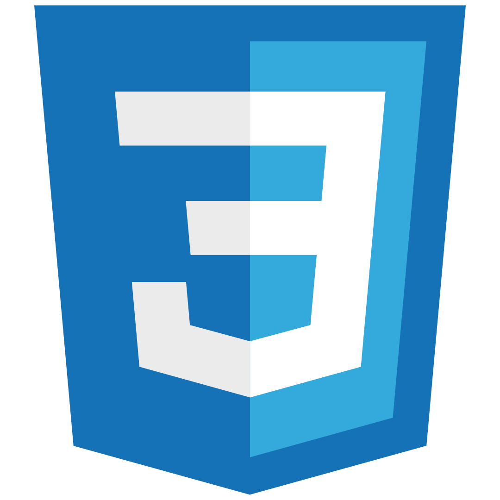
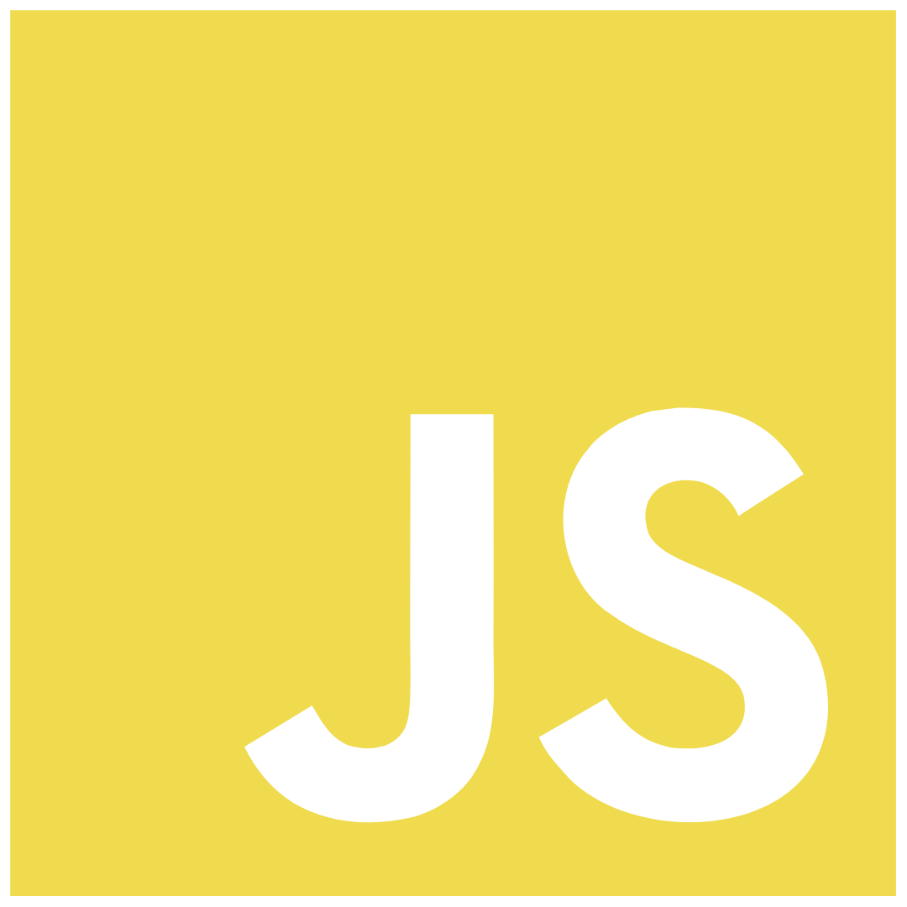

### Languages:
	
  
  
  
  
   
	
### Tools
	
  
	

&nbsp;
&nbsp;
&nbsp;
&nbsp;
&nbsp;
&nbsp;
&nbsp;
&nbsp;
&nbsp;
&nbsp;
&nbsp;
&nbsp;
	
	

## Recent Contributions

Repository Name|Repository Owner|Date of contributions|-----↴
-|-|-|-
[peer-to-peer](https://github.com/JeffC25/peer-to-peer) | [JeffC25](https://github.com/JeffC25) | April 13 2023 | May 21 2023
[resources](https://github.com/NisooJadhav/resources) | [NisooJadhav](https://github.com/NisooJadhav) | May 31 2023 | June 1 2023
[Arrays-DSA-Coding-Questions](https://github.com/CodingWallah/Arrays-DSA-Coding-Questions) | [CodingWallah](https://github.com/CodingWallah) | June 10 2023 | June 13 2023

---
 

 &nbsp;&nbsp;&nbsp;
 &nbsp;&nbsp;&nbsp;
 &nbsp;&nbsp;&nbsp;

