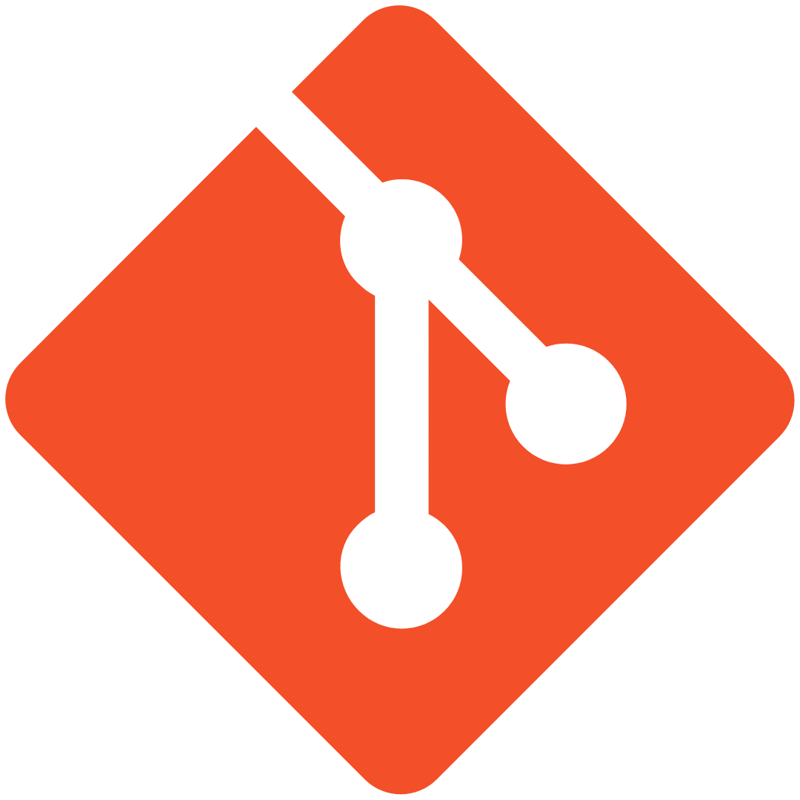

<h1 align="center">Hi 👋, I'm Pallav Jain</h1>
<h3 align="center">A Student from India</h3>

  

- 🌱 I’m currently learning **Backend Web Development**

- 👨‍💻 All of my projects are available at my **[Github Profile](https://github.com/PallavJain01?tab=repositories)**

### Languages:

	
  
  

  

  
   
	
### Tools
	
  <a href="https://git-scm.com/" target="_blank" rel="noreferrer">
<<<<<<< HEAD
    
=======
    
  </a>
	
  

	

	&nbsp;
	

## Recent Contributions

Repository Name|Repository Owner|Date of contributions|-----↴
-|-|-|-
[peer-to-peer](https://github.com/JeffC25/peer-to-peer) | [JeffC25](https://github.com/JeffC25) | April 13 2023 | May 21 2023
[resources](https://github.com/NisooJadhav/resources) | [NisooJadhav](https://github.com/NisooJadhav) | May 31 2023 | June 1 2023
[Arrays-DSA-Coding-Questions](https://github.com/CodingWallah/Arrays-DSA-Coding-Questions) | [CodingWallah](https://github.com/CodingWallah) | June 10 2023 | June 13 2023

---
 &nbsp;&nbsp;&nbsp;
 &nbsp;&nbsp;&nbsp;
 &nbsp;&nbsp;&nbsp;
<<<<<<< HEAD

=======
>>>>>>> parent of 92b61bc (overhauled readme)
